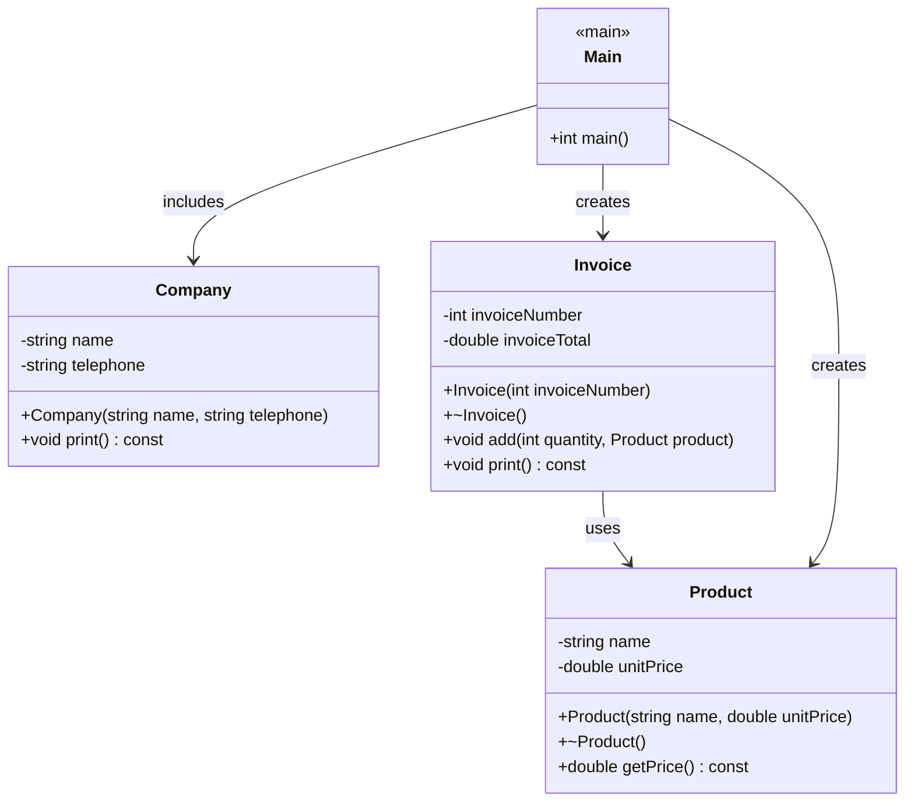

```mermaid
%%2025년도 2학기 c++ 프로그래밍 수업 원격 리포지토리


classDiagram

   class Company {

       -string name

       -string telephone

       +Company(string name, string telephone)

       +void print() const

   }

   

   class Product {

       -string name

       -double unitPrice

       +Product(string name, double unitPrice)

       +~Product()

      +double getPrice() const

   }

  

   class Invoice {

       -int invoiceNumber

       -double invoiceTotal

       +Invoice(int invoiceNumber)

       +~Invoice()

       +void add(int quantity, Product product)

       +void print() const

   }

  

   class Main {

       <<main>>

      +int main()

   }

 

   Invoice --> Product : uses

   Main --> Product : creates

   Main --> Invoice : creates

   Main --> Company : includes
```
